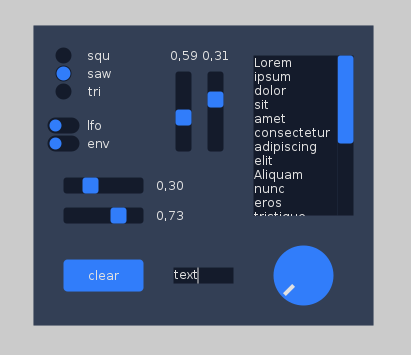

# abcdgui

This is a small immediate mode gui library developed to support the [plumdemo](https://github.com/beatwise/plumdemo) project.
This library is a gui toolkit meant to be embedded in windowing systems. To build a complete
application with it, you need to develop a cooperating application based upon some windowing system.

Currently, it needs a revision and it's not recommended for production.

DEPENDENCIES:
-------------

cairomm

